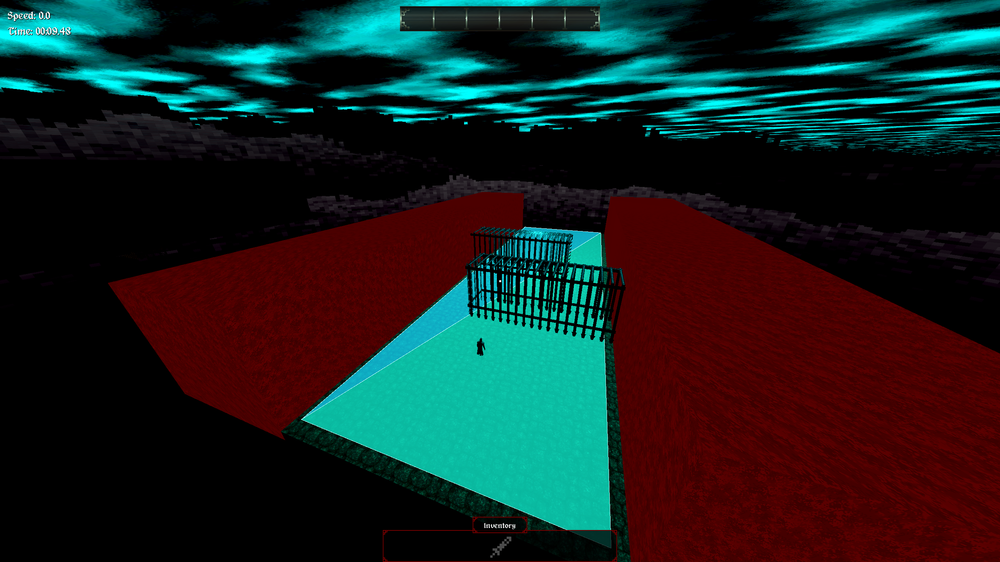

# Bloodthief Mapping Guide
This guide is meant to be used like a wiki for you to reference for all your mapping needs. Trenchbroom is the software that is used to make Bloodthief maps. It is free, open source, and used to make maps for many games, such as Quake, Dusk, Wrath: Aeon of Ruin, and many more. Trenchbroom is great because it’s specifically designed for making interactive maps, which makes getting started making a real level easy, but the possibilities are still limitless!

## Get Started
* [Watch the official get started tutorial](https://youtu.be/09mth4fUaH0)
* [Bloodthief mapping assets](https://drive.google.com/file/d/1IHrSjtdWp4tyQuInjpUgVuiSBSwXTLnh/view?usp=drive_link)
* [Example Map - Time Tomb](https://drive.google.com/file/d/1ug1_SbQ-79RKrOdk9USPT0Q1SCSGNpa7/view?usp=drive_link)
* [Trenchbroom Manual](https://trenchbroom.github.io/manual/latest/)
* [Dumptruck_ds Trenchbroom Tutorial Series](https://www.youtube.com/watch?v=gONePWocbqA&list=PLgDKRPte5Y0AZ_K_PZbWbgBAEt5xf74aE&index=1)
* [Entity Reference](/entity-reference)

## Getting Set Up
1. Download [Trenchbroom](https://github.com/TrenchBroom/TrenchBroom/releases/tag/v2025.3)
2. Navigate to the folder where you downloaded Trenchbroom and click inside the Trenchbroom folder. Click inside the "games" folder. Download the [Bloodthief mapping assets](https://drive.google.com/file/d/1IHrSjtdWp4tyQuInjpUgVuiSBSwXTLnh/view?usp=drive_link). Unzip it, open it, and drag the "BloodthiefMapping" folder into the "games" folder mentioned above
3. Now open up the Trenchbroom.exe which is at the root of the trenchbroom folder
4. Click New Map, then click Open Preferences
5. You should see BloodthiefMapping as an option. Click it, and on the righthand side set the "Game Path" to the BloodthiefMapping folder that you put inside the games folder in step 2. So if you downloaded Trenchbroom to your Desktop, the path might be C:\users\yourname\Desktop\TheTrenchbroomFolderName\games\BloodthiefMapping
6. Hit Apply, then OK.
7. Now you're ready to start mapping! Open the game, hit Play, go to the My Maps tab and hit "Create New Map". When the map starts, in the pause menu you should see an option to "Open Map Data Folder". When you open that map, you should see a .map file. Open that file in Trenchbroom! (see next section)

!!!info "Important Tip"
	#### Opening Map Files in Trenchbroom
	You can either open Trenchbroom normally, then click File -> Open Document and find the map file in the folder in Step 8 above, or you can set up Trenchbroom to be the "default program" for MAP files that way when you double click on your map file in the file explorer, and your map automatically opens in Trenchbroom.

	#### Setting Trenchbroom to be the "default program" for MAP files.
	1. Right click on the MAP file in Step 8 of [Getting Set Up](getting-set-up) and hover over "Open With" and click "Choose another app". 
	2. Scroll down to "More Apps" 
	3. Scroll Down to "Look for another app on this PC"
	4. Locate where you downloaded Trenchbroom, click on the Trenchbroom.exe file and hit "Open". Now MAP files will automatically open with Trenchbroom when you double click them. 

## FAQs
### Why does water look weird sometimes?
Water and lava are prone to weird visual artifacts, like this:

You can prevent this by clipping the top/exposed parts of the water or lava.

You can do this by making the whole brush a clip brush, then shift-clicking the faces you want to make the water texture, and selecting the water texture.

You will use the clip texture a lot. I assigned a hotkey so I don’t have to find the clip texture every time I need to apply it to something. Go to view -> preferences -> keyboard and find “Tags/turn selection into Clip” and assign that to your key of choice. I used backtick (`).

### Why is enemy navigation / pathfinding not working? 
When your map is really big, navigation can start to perform poorly and overall just start to work badly if you don't do any optimization. Take this example

In this example, I am running the game in debug mode so I can see all of the navigable area (unfortunately this isn't possible for mappers to do, but it is useful for this example nonetheless). 

By default **everything is navigable**. For this example we have an enemy in a playable area with some obstacles, with big red walls on the side. Notice how the tops of the big red walls are blue, showing that the tops of the walls are navigable. This is wasteful and causes enemy navigation to take longer for no good reason, because no enemies are ever going to get up there! Ideally only places where enemies actually need to traverse are navigable. 

We can optimize this by explicitly specifying the areas we want to be navigable. First we must select the ground floor and make it a `func_geo` entity. `func_geo` has more features than the default brush type which is `worldspawn`. We will then give the ground a property `navigable` with value `1`. This will switch the map builder to a new mode, where now *only geometry specified to be navigable* will be treated as such. If we build we get this. Notice the tops of the walls are no longer blue. But now we have a new problem!

If you look closely, our ground region is no longer snaking around the obstacles, it is going right through them - so the enemy will not avoid the obstacles and will try to run right through them. We can fix this by selecting the inner obstacles and making them `func_detail` entities and setting the `navigable` property to `1` for those. Then we get this:

Now the region is properly snaking around the obstacles. Note that we made the inner obstacles `func_detail`, but `func_geo` would have worked also. I chose `func_detail` because our obstacles have transparent materials. func_detail entities don't cull objects behind them, so it is good to use that entity when using transparent materials. See [Geometry becoming invisible behind materials with transparency](#geometry-becoming-invisible-behind-materials-with-transparency)

### My map is completely broken suddenly. What happened??
This issue is usually caused by empty properties in various entities. For example, if one of your entities has “property 1” in it, you should remove that. Sometimes this can happen if you hit the plus sign to add a property and forget to remove it later. If you suspect this could be the issue you can hit ctrl + A to select all entities and look at the properties panel to see if you see any strange / bad looking properties in your entire map.

### Why is geometry becoming invisible behind materials with transparency?
This is due to occlusion culling. The mesh in front is culling the mesh behind. If you don’t want the mesh in front to do any culling, make it a func_detail or func_detail_illusionary

### How do I set up shielded enemies?
You can give an enemy a shield simply by adding a `bubble_shield_id` property to that enemy and giving the property *any value*.

If you want a mage to be the source of the shield, so when you kill the mage, the shield goes away, assign the enemy a `targetname` of any value, and assign the mage a `target` of the same value. 

#### Mages that shield multiple enemies at once
Simply give all the enemies shielded by a mage the same `bubble_shield_id` and the same `targetname`. Note that enemies with a different `targetname` but the same `bubble_shield_id` will still lose their shields when the mage dies that is shielding other enemies with the same `bubble_shield_id`.

### How do I lock a door so one or more keys is required to open it?
1. Place a `vt_key_pickup` entity and give it a unique `key_name`, such as `key1`
2. Create a `vt_mover` - this will be your door so give it `tb_translation` `0 0 320` to have it go up 320 Trenchbroom Units when activated. Give it targetname `door1`
3. Create a `vt_trigger_area` and give it a `target` of `door1` 
4. Now the door will open when we go in the trigger area-  but we want to require that you have the key first!
5. To make it so the key is required, put your unique key name in the `required_keys_comma_sep` field of the vt_trigger_area. Now the trigger wont fire until you have the key. 
6. To require multiple keys, simply put them all in the `required_keys_comma_sep` field, separated by a comma, like this `key1,key2,key3,key4`. Now all 4 of those keys will be required to open the door. Make sure there is a corresponding `vt_key_pickup` with `key_name` set for each of those 4 keys!  